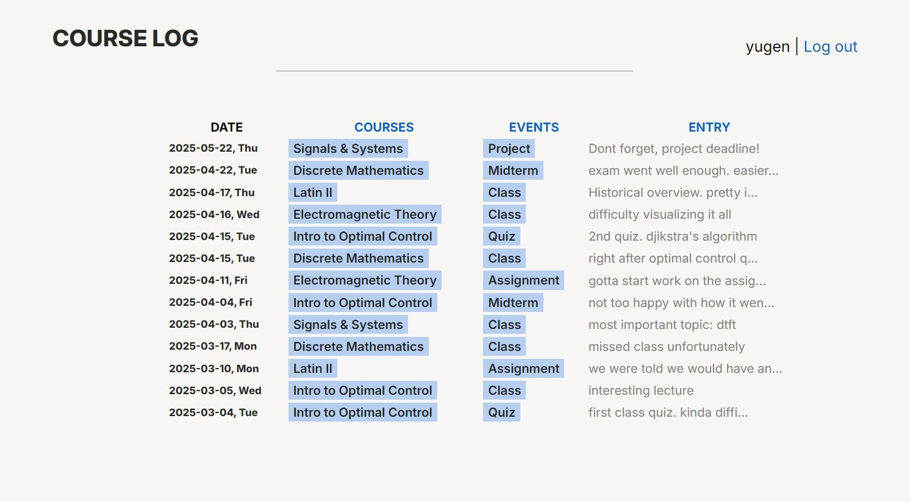
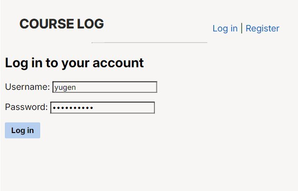
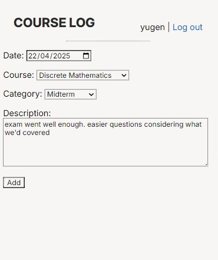
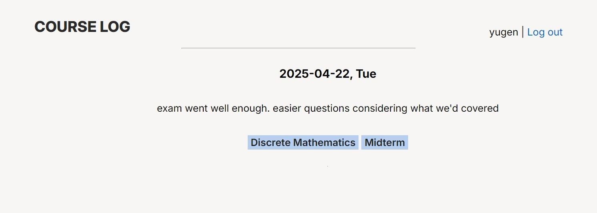
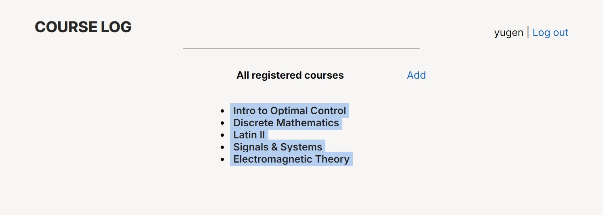
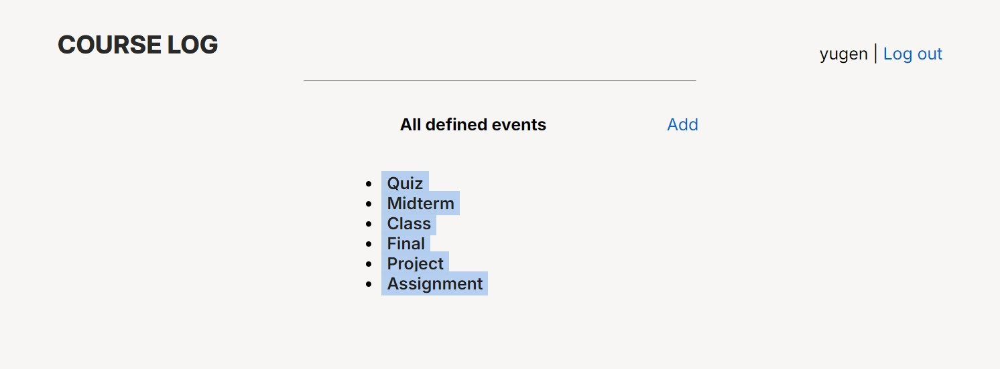

# School Course Log with Django
- minimal
- responsive

### Overview

    

### Register/Login

    

### Logging  entries

    

### Viewing logged entries

    

### Managing courses and events

    

    

